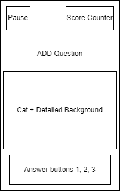

**Software Requirements Specification**

**for**

**CAT MATHS**

**Version 1**

**Prepared by Team 1 of Software Engineering Concepts Class**

**California State University, San Bernardino**

**Contents**

1.  

> [**Introduction**](https://docs.google.com/document/d/1Z0f3G66ktjPd5w3scrHqGQGpUeXAgPrn-NT0akg0-Mc/edit#heading=h.gjdgxs)
> **4**
>
> [1.1 Purpose . . . . . . . . . . . . . . . . . . . . . . . . . . . . .
> . . . . . . . .
> .](https://docs.google.com/document/d/1Z0f3G66ktjPd5w3scrHqGQGpUeXAgPrn-NT0akg0-Mc/edit#heading=h.30j0zll)
> 4
>
> 1.2 Document Conventions [. . . . . . . . . . . . . . . . . . . . . .
> . . . . . . . . . . . . . . . .
> .](https://docs.google.com/document/d/1Z0f3G66ktjPd5w3scrHqGQGpUeXAgPrn-NT0akg0-Mc/edit#heading=h.1fob9te)
> 4
>
> 1.3 Intended Audience & Reading Suggestions [. . . . . . . . . . . . .
> . . . . . . . . . . . . . . . . . . .
> .](https://docs.google.com/document/d/1Z0f3G66ktjPd5w3scrHqGQGpUeXAgPrn-NT0akg0-Mc/edit#heading=h.1fob9te)
> . 4
>
> 1.4 Product Scope [. . . . . . . . . . . . . . . . . . . . . . . . . .
> . . . . . . . . . . .
> .](https://docs.google.com/document/d/1Z0f3G66ktjPd5w3scrHqGQGpUeXAgPrn-NT0akg0-Mc/edit#heading=h.30j0zll)
> 4
>
> 1.5 References [. . . . . . . . . . . . . . . . . . . . . . . . . . .
> . . . . . . . . . .
> .](https://docs.google.com/document/d/1Z0f3G66ktjPd5w3scrHqGQGpUeXAgPrn-NT0akg0-Mc/edit#heading=h.30j0zll)
> 4

2.  

> [**Overall
> Description**](https://docs.google.com/document/d/1Z0f3G66ktjPd5w3scrHqGQGpUeXAgPrn-NT0akg0-Mc/edit#heading=h.3znysh7)
> **5**
>
> 2.1 Product Perspective [. . . . . . . . . . . . . . . . . . . . . . .
> . . . . . . . .
> .](https://docs.google.com/document/d/1Z0f3G66ktjPd5w3scrHqGQGpUeXAgPrn-NT0akg0-Mc/edit#heading=h.2et92p0)
> 5
>
> 2.2 Product Functions [. . . . . . . . . . . . . . . . . . . . . . . .
> . . . .
> .](https://docs.google.com/document/d/1Z0f3G66ktjPd5w3scrHqGQGpUeXAgPrn-NT0akg0-Mc/edit#heading=h.tyjcwt)
> 5
>
> 2.3 User Classes and Characteristics [. . . . . . . . . . . . . . . .
> . . . . . . . . . . . . . . . . . . . . .
> .](https://docs.google.com/document/d/1Z0f3G66ktjPd5w3scrHqGQGpUeXAgPrn-NT0akg0-Mc/edit#heading=h.30j0zll)
> 6
>
> 2.4 Operating Environment [. . . . . . . . . . . . . . . . . . . . . .
> . . . . . . . . .
> .](https://docs.google.com/document/d/1Z0f3G66ktjPd5w3scrHqGQGpUeXAgPrn-NT0akg0-Mc/edit#heading=h.2et92p0)
> 6
>
> 2.5 Design and Implementation Constraints [. . . . . . . . . . . . . .
> . . . . . . . . . . . . .
> .](https://docs.google.com/document/d/1Z0f3G66ktjPd5w3scrHqGQGpUeXAgPrn-NT0akg0-Mc/edit#heading=h.2et92p0)
> 6 2.6 User Documentation [. . . . . . . . . . . . . . . . . . . . . .
> . . . . . . .
> .](https://docs.google.com/document/d/1Z0f3G66ktjPd5w3scrHqGQGpUeXAgPrn-NT0akg0-Mc/edit#heading=h.2et92p0)
> 6
>
> 2.7 Assumptions and Dependencies [. . . . . . . . . . . . . . . . . .
> . . . . . . . . .
> .](https://docs.google.com/document/d/1Z0f3G66ktjPd5w3scrHqGQGpUeXAgPrn-NT0akg0-Mc/edit#heading=h.2et92p0)
> 6

**3 External Interface Requirements 7**

3.1 User Interfaces (Screens) [. . . . . . . . . . . . . . . . . . . . .
. . . . . . . . .
.](https://docs.google.com/document/d/1Z0f3G66ktjPd5w3scrHqGQGpUeXAgPrn-NT0akg0-Mc/edit#heading=h.2et92p0)
**7**

3.2 Hardware Interfaces [. . . . . . . . . . . . . . . . . . . . . . . .
. . . . . .
.](https://docs.google.com/document/d/1Z0f3G66ktjPd5w3scrHqGQGpUeXAgPrn-NT0akg0-Mc/edit#heading=h.2et92p0)
8

3.3 Software Interfaces [. . . . . . . . . . . . . . . . . . . . . . . .
. . . . . .
.](https://docs.google.com/document/d/1Z0f3G66ktjPd5w3scrHqGQGpUeXAgPrn-NT0akg0-Mc/edit#heading=h.2et92p0)
8

3.4 Communication Interfaces [. . . . . . . . . . . . . . . . . . . . .
. . . . . . . . .
.](https://docs.google.com/document/d/1Z0f3G66ktjPd5w3scrHqGQGpUeXAgPrn-NT0akg0-Mc/edit#heading=h.2et92p0)
9

### **4 System Features 9** 

###  4.1 Starting Screen [. . . . . . . . . . . . . . . . . . . . . . . . . . . . . . .](https://docs.google.com/document/d/1Z0f3G66ktjPd5w3scrHqGQGpUeXAgPrn-NT0akg0-Mc/edit#heading=h.2et92p0) 9

4.2 Main Game Screen [. . . . . . . . . . . . . . . . . . . . . . . . .
. . . . .
.](https://docs.google.com/document/d/1Z0f3G66ktjPd5w3scrHqGQGpUeXAgPrn-NT0akg0-Mc/edit#heading=h.2et92p0)
10

4.3 Answering [. . . . . . . . . . . . . . . . . . . . . . . . . . . . .
.
.](https://docs.google.com/document/d/1Z0f3G66ktjPd5w3scrHqGQGpUeXAgPrn-NT0akg0-Mc/edit#heading=h.2et92p0)
10

4.4 Ending Screen [. . . . . . . . . . . . . . . . . . . . . . . . . . .
. . .
.](https://docs.google.com/document/d/1Z0f3G66ktjPd5w3scrHqGQGpUeXAgPrn-NT0akg0-Mc/edit#heading=h.2et92p0)
10

**5** **Other Nonfunctional Requirements 11**

5.1 Performance Requirements [. . . . . . . . . . . . . . . . . . . . .
. . . . . . . . .
.](https://docs.google.com/document/d/1Z0f3G66ktjPd5w3scrHqGQGpUeXAgPrn-NT0akg0-Mc/edit#heading=h.2et92p0)
11

5.2 Safety Requirement [. . . . . . . . . . . . . . . . . . . . . . . .
. . . . . .
.](https://docs.google.com/document/d/1Z0f3G66ktjPd5w3scrHqGQGpUeXAgPrn-NT0akg0-Mc/edit#heading=h.2et92p0)
11

5.3 Security Requirements [. . . . . . . . . . . . . . . . . . . . . . .
. . . . . . .
.](https://docs.google.com/document/d/1Z0f3G66ktjPd5w3scrHqGQGpUeXAgPrn-NT0akg0-Mc/edit#heading=h.2et92p0)
12

5.4 Software Quality Attributes [. . . . . . . . . . . . . . . . . . . .
. . . . . . . . . .
.](https://docs.google.com/document/d/1Z0f3G66ktjPd5w3scrHqGQGpUeXAgPrn-NT0akg0-Mc/edit#heading=h.2et92p0)
12

5.5 Business rules [. . . . . . . . . . . . . . . . . . . . . . . . . .
. . . .
.](https://docs.google.com/document/d/1Z0f3G66ktjPd5w3scrHqGQGpUeXAgPrn-NT0akg0-Mc/edit#heading=h.2et92p0)
12

**6 Other Requirements 12**

6.1 Storage Solution [. . . . . . . . . . . . . . . . . . . . . . . . .
. . . . .
.](https://docs.google.com/document/d/1Z0f3G66ktjPd5w3scrHqGQGpUeXAgPrn-NT0akg0-Mc/edit#heading=h.2et92p0)
12

6.2 Design [. . . . . . . . . . . . . . . . . . . . . . . . . . . . . .
.](https://docs.google.com/document/d/1Z0f3G66ktjPd5w3scrHqGQGpUeXAgPrn-NT0akg0-Mc/edit#heading=h.2et92p0)
12

6.3 Task [. . . . . . . . . . . . . . . . . . . . . . . . . . . . . .
.](https://docs.google.com/document/d/1Z0f3G66ktjPd5w3scrHqGQGpUeXAgPrn-NT0akg0-Mc/edit#heading=h.2et92p0)
12

6.4 Cohesiveness [. . . . . . . . . . . . . . . . . . . . . . . . . . .
. . .
.](https://docs.google.com/document/d/1Z0f3G66ktjPd5w3scrHqGQGpUeXAgPrn-NT0akg0-Mc/edit#heading=h.2et92p0)
13

**1. INTRODUCTION**

### **1.1 Purpose** 

This document outlines the software requirements specifications for a
mobile math game app that teaches addition to children ages 6-9. The
goal of this SRS is to capture requirements for key app features and
functionality to guide development of the system.

### **1.2 Document Conventions**

This SRS follows a standard template structure with numbered sections
and subsections. Requirements are written in clear language aimed at the
technical and non-technical stakeholders involved in the project.
Screenshots and diagrams are included where relevant to illustrate
requirements.

### **1.3 Intended Audience and Reading Suggestions**

The key intended audiences for this document are developers, QA testers,
product managers, and designers involved in building the system. It is
recommended that all audiences first read the Overall Description and
System Features sections for a high-level understanding before
consulting specific requirements details.

### **1.4 Product Scope**

The scope of this release focuses on core mathematical gameplay and
mechanics for addition problems aimed at early elementary grade levels.
Advanced features like customization, social sharing, analytics etc. are
considered out of scope.

### **1.5 References**

-   **[Software Engineering: A Practitioner\'s Approach]{.mark}**

> **[https://ebookcentral.proquest.com/lib/csusb/detail.action?docID=6328275&pq-
> origsite=primo]{.mark}**

-   **[ChatGPT]{.mark} https://chat.openai.com/auth/login**

-   **[ChatUml]{.mark} https://chatuml.com/edit/new**

**2. Overall Description**

**2.1 Product Perspective**

The game aims to closely replicate the popular children\'s math app
found on the Play Store, with its main objective being to gamify the
learning of addition through the use of cat animation, making it both
easier to grasp and more entertaining for kids to learn.

# **2.2 Product Functions**

The game aims to assist children in learning basic addition through a
range of games with varying difficulty levels. High-quality cartoon
animations and sounds are incorporated strategically to enhance both
learning and enjoyment. Below is a summary of the game\'s key features
implemented.

They are separated into categories depending on their function:

-   **Title / Menu screen**: The first screen users encounter upon
    opening the application displays buttons for both gameplay and
    settings.

-   **Cat character**: A cat character animation has been designed to
    actively engage children within the application.

-   **Generating random numbers and validating them:** Various numbers
    are generated along with the correct answers for the give addition
    game question.

-   **Generate questions and validate the answers with reactions:** The
    addition questions are accompanied by cat animations, displaying a
    happy emoji for correct answers and a sad emoji for incorrect ones.

-   **Generating sound for question:** For each question, sound effects
    accompany the prompt, with correct answers receiving positive
    feedback and incorrect ones receiving none.

-   **Kids learning progress monitoring:** Upon completing each level,
    it displays the accuracy rate, number of correct answers, incorrect
    answers and Rate allowing for easy tracking of progress.

# 

# **2.3 User Classes and Characteristics**

The game\'s controls are easy to understand, and the gameplay is fair
for everyone, so it won\'t make a big difference in who plays it. But
like any game, there are different types of players: some who play a lot
and some who just play sometimes. In this game, the ones who play a lot
are kids in primary school.

# **2.4 Operating Environment**

This application will be launched on both the Play Store (Android) and
App Store (iOS). A web- based platform is not currently intended.

# **2.5 Design and Implementation Constraints**

The CAT MATHS ADD game app for kids is a very minimalistic app both in
its functionality and user experience. As of now, there are no
constraints that are noticed by the developers.

# **2.6 User documentation**

This app is straightforward and basic, users won\'t encounter
significant challenges. We have not implemented any complex operations
that pose compatibility issues. Children who are just beginning their
learning journey can easily use the app without any trouble.

# **2.7 Assumptions and Dependencies**

We\'ll employ Unity 2D for graphics in this project. Once testing is
complete, we\'ll determine the minimum requirements and the earliest
version of Android to support before launching the game on the market.
Currently, there don\'t seem to be any dependencies for this app, as
it\'s standalone and doesn\'t involve any complex operations.

**3. External Interface Requirements**

This section of the SRS outlines the specifications for the system\'s
interface, covering user, hardware, software, and communication
requirements.

**3.1 User Interfaces**

**3.1.1 Main Screen/Home Screen:**

{width="2.6770833333333335in"
height="3.2193853893263342in"}

**Figure 01:** Initial loading screen for the CAT MATHS

**3.1.2 Gameplay:**

For every new question generated a new monster appears after successfull
5 correct answers boss monster appears indicating last chance for
winning or losing a game.

**3.1.3 Game over:**

Whenever an appropriate task is incomplete, the game over-screen will
appear and prompt the user to continue the game.

**3.1.3.1 Invoke restart level.**

When invoked, the current game level restarts.

**3.1.3.2 Invoke Home menu.**

When invoked, the game returns to home menu screen.

**3.1.4. Level Complete**

Level completed for CAT MATHS.

**3.1.4.1 Invoke Restart Level**

When invoked, the current game level restarts.

**3.1.4.2 Invoke home menu.**

When clicked the game returns to home screen.

**3.2 Hardware Interfaces**

The Math Kid Game for Kids' mobile app may interact with the following
hardware interfaces

**3.2.1 Touchscreen Interface**

**Description**: The app relies on the device\'s touchscreen interface
for user interactions, such as tapping buttons, entering answers, and
navigating menus.

**Functionality**: The app should respond to touchscreen gestures,
including taps, swipes, and multi-touch interactions.

**3.2.2 Speaker and Audio Interface**

**Description**: The app uses the device\'s speaker and audio interface
to provide audio

feedback, including sounds, music, and spoken instructions.

**Functionality**: The app should play audio cues, instructions, and
background music through the device\'s speaker.

**3.3 Software Interfaces**

**3.3.1 Unity**

The application will use the Unity game engine for the user interface of
the connectome application. While the application will not contain any
game components, the framework makes the interface with the Math Kid
Game easy. A 32-bit personal version of the Unity game engine is used
for the project. None of the components of the professional version
should be needed for the application. Unity version 5.5 is used for the
development of the project.

**3.3.2 VisualStudio**

A streamlined code editor, Visual Studio Code supports development
activities like task execution, debugging, and version management. It
seeks to offer only the tools a developer needs for a brief
code-build-debug cycle and leaves more complicated processes to IDEs
with more features, like Visual Studio IDE.

**3.3.3 AzureDevOps**

Azure DevOps, created by Microsoft, is an extensive collection of
development tools and services designed to oversee the complete software
development lifecycle. It encompasses capabilities for source code
management, build automation, continuous integration and delivery
(CI/CD), project tracking, and other functionalities. Azure DevOps
facilitates efficient team collaboration, leading to the delivery of
high-quality software products.

**3.3.4 AzureFunctions**

Azure Functions is a serverless solution that enables you to write
minimal code, reduce infrastructure management, and cut costs. Rather
than dealing with server deployment and maintenance, the cloud
infrastructure automatically supplies the necessary resources to keep
your applications operational.

**3.3.5 VisualStudioAppCenter**

Visual Studio App Center is a cloud-based service designed to offer
developers a toolkit for building, testing, distributing, and monitoring
applications across multiple platforms, including iOS, Android, Windows,
macOS, React Native, and Xamarin.

**3.4 Communications Interfaces**

No interface requirements are necessary as there is no need for network
activity.

**4.System Features**

**4.1 Title/Menu Screen**

**4.1.1 Description and Priority**

The title screen serves as the initial interface where players can
choose to start the game or modify options. As the central hub for all
project activities, the home/menu screen is essential and should be
incorporated.

**4.1.2 Stimulus/Response Sequences**

**Step 1:** Players will initiate the game from their portable devices.

**Step 2:** Upon loading, the start screen prompts the player to begin
the game. In the

third step, the player presses the button, initiating the actual
gameplay.

**4.1.3 Functional Requirements:**

**RFQ-1:** The home/menu screen must load and appear every time the game

M4.2 4.2.1 is launched.

**RFQ-2:** If the player quits the game during any stage of a level,
they must be returned

to main screen

**RFQ-3:** If the player presses the exit button, the game will end.

**RFQ-4:** If the player completes the game, it will take them to the
Level complete

screen and then the player can replay the game or go to the home screen.

**4.2 Generate random numbers and validate the answers.**

**4.3.1 Description and Priority:**

Upon reaching the Adding Puzzle screen from the menu, players encounter
addition questions. They must choose the correct answer and drag it to
the appropriate location. A correct response triggers a cat animation,
confirming accuracy. If the answer is incorrect, the player receives a
prompt notifying them of the mistake.

**4.2.2 Stimulus/Response Sequences:**

**Step 1:** The player navigates to the gameplay screen from the main
screen.

**Step 2:** On the screen, we can see a cat, and monster, and some
random numbers

along with accurate numbers for response.

**Step 3:** An addition question will be generated with random numbers
and

displayed on the screen.

**Step 4:** In the answer board random numbers are generated, including
the correct

answer.

**Step 5:** Once the answer is selected from the board, a cat animation
will pop up

acting as to whether the answer is correct or incorrect.

**4.2.3 Functional Requirements:**

**RFQ-1:** The cat should appear on the screen and indicate the answer
is correct if the

player selects the correct answer from the random numbers.

**RFQ-2:** When the player chooses the correct answer, a cat animation
needs to be

played.

**RFQ-3:** When the player chooses the wrong response, it should
indicate the answer is

incorrect.

**RFQ-4:** By clicking on the pause menu window button displayed at the
top left corner, the

Player can go back to the screen and choose the game options like back
to the home

screen.

### 

### **5. Other Nonfunctional Requirements**

### **5.1 Performance Requirements**

The app should provide a smooth, responsive user experience. Response
times for answering questions and navigation interactions should be
under 500ms to avoid any perception of lag. Animations and transitions
between screens should maintain a minimum frame rate of 60fps for
seamless visual feedback. The app launch process itself should take no
longer than 5 seconds. Performance should be optimized to consume
minimal device battery and memory resources, avoiding excessive CPU
usage or power draw.

### 

### **5.2 Safety Requirements**

As a child-focused educational app, safety is paramount. No dangerous,
inappropriate, or mature content should be present. External ads, links,
or other content from unverified sources must be avoided. The app should
adhere to all applicable app store guidelines for child appropriate
content ratings. Math questions and concepts must be age-appropriate and
non-violent.

### 

### **5.3 Security Requirements**

User data privacy and security is important, especially for an app aimed
at children. Network transmission of any user data or telemetry must be
encrypted. Any user identifiers, scores, or other stored data should be
properly secured via access controls. No personally identifiable
information should be collected or transmitted without clear disclosure
and consent.

### 

### **5.4 Software Quality Attributes**

The app should deliver an intuitive, easy to use interface following
established mobile conventions and optimized for simplicity. Visual
design should be friendly, engaging, and appropriate for the target age
group. Mathematical logic must be accurate and

calculations precise reflecting valid addition fundamentals. Support for
accessibility features like text-to-speech could aid usage for those
with disabilities.

### 

### **5.5 Business Rules**

N/A

### **6. Other Requirements**

### **6.1 Storage Solution**

User profile data including usernames, scores, and progress will be
stored in a NoSQL cloud database like MongoDB. Game question data can be
stored in a JSON file bundled with the app package. Any media assets can
be stored in object storage such as AWS S3.

### **6.2 Design**

The app design should follow Google\'s Material Design principles
optimized for mobile. It should use a simple, intuitive navigational
paradigm common to other educational apps. The visual style should be
bright, fun, and engaging for kids.

### **6.3 Task**

Key tasks the app needs to support include:

-   Registering a user profile

-   Selecting a game mode or difficulty level

-   Displaying and answering math questions

-   Scoring gameplay and storing results

-   Providing feedback on answers

-   Pausing and resuming gameplay

All core gameplay functionality should provide clear calls-to-action,
feedback, and transitions between tasks.

### **6.4 Cohesiveness**

The app should provide a cohesive user experience with consistent UI/UX
design patterns and standardized visual styles. Interactions should be
intuitive with clear response to user input. Terminology should be
simple and concise. Components like colors, fonts, icons should all
align to a unified aesthetic style.

# 7. **Appendix: Analysis Models**

A.  **UML Use Case Diagram**

> {width="6.5in"
> height="4.6194444444444445in"}

B.  **UML Class Diagram**

{width="6.5in"
height="3.884027777777778in"}

C.  **UML Sequence Diagram**

{width="5.5569444444444445in"
height="9.0in"}
